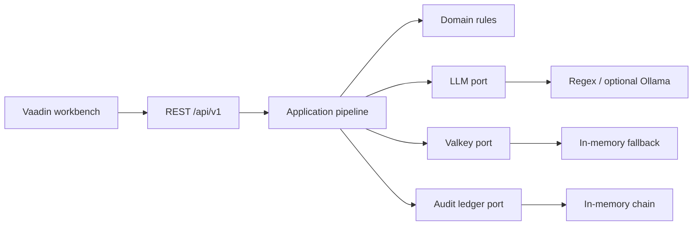

# VeriLogic Engine

[](https://github.com/UGilfoyle/verilogic-engine/actions/workflows/ci.yml)
[](https://openjdk.org/projects/jdk/21/)
[](https://spring.io/projects/spring-boot)
[](https://vaadin.com/)
[](LICENSE)

Deterministic loan decision engine with statutory rule proofs, a chained SHA-256 audit ledger, and a Vaadin workbench.

The engine evaluates Qualified Mortgage DTI, Basel III liquidity, and AML solvency rules in-process. It does **not** require Ollama or Valkey to start: those adapters fail open to a regex extractor and an in-memory lock.

---

## What it does

- Scores a structured bank-statement payload or a free-text loan memo against three published rule formulas
- Rejects tampered PDFs and unbalanced ledgers before policy evaluation
- Seals every decision into a Merkle-linked certificate (`H(input ‖ rules)` / `H(proof ‖ previous)`)
- Exposes the same pipeline through REST and a four-screen workbench

This is a high-assurance **demo and research engine**. The default ledger lives in memory. Do not treat a single-process run as a production system of record.

---

## Architecture



| Module | Role |
|---|---|
| `verilogic-domain` | Pure Java models and MC/DC rule tables. Zero framework imports. |
| `verilogic-application` | Use cases, ports, prompt-injection scan, reconciliation loop. |
| `verilogic-infrastructure` | Valkey, Ollama, deterministic solver, in-memory ledger. |
| `verilogic-ui` | Vaadin 24 workbench and REST gateway. |

---

## Quick start

### Prerequisites

- Java 21 LTS
- Maven 3.9+ (or the bundled `./mvnw`)

### Run locally

```bash
git clone https://github.com/UGilfoyle/verilogic-engine.git
cd verilogic-engine
./mvnw -B test
./mvnw -pl verilogic-ui -am spring-boot:run
```

Open [http://localhost:8080](http://localhost:8080).

To build a runnable jar:

```bash
./mvnw -B package -DskipTests
java -jar verilogic-ui/target/verilogic-ui-1.0.0-SNAPSHOT.jar
```

### Docker

```bash
docker compose up --build
```

Valkey starts automatically. The app still works if you stop Valkey later; locks fall back to process memory.

---

## REST API

Base URL: `http://localhost:8080`

| Method | Path | Purpose |
|---|---|---|
| `GET` | `/api/v1/health` | Liveness |
| `POST` | `/api/v1/underwrite/clearledger` | Structured statement underwriting |
| `POST` | `/api/v1/cases/evaluate` | Free-text memo underwriting |
| `GET` | `/api/v1/certificates/{id}` | Fetch a sealed certificate |
| `GET` | `/api/v1/certificates/case/{caseId}` | Fetch by case id |
| `GET` | `/api/v1/ledger/recent` | Recent certificates |
| `GET` | `/api/v1/ledger/verify` | Recompute the hash chain |

### Underwrite a bank statement

`POST /api/v1/underwrite/clearledger`

```json
{
  "bankName": "HDFC Bank",
  "accountNumber": "9018420911",
  "accountHolder": "Rajesh Sharma",
  "totalCredits": 80400.0,
  "totalDebits": 16800.0,
  "loanAmountRequested": 300000.0,
  "hasGuarantor": true,
  "monthsOfHistory": 6,
  "fraud": {
    "overallRiskScore": 8,
    "riskLevel": "LOW",
    "documentAuthenticity": 99.8,
    "isTamperedPDF": false,
    "averageBankBalance": 54200.0,
    "salaryDetected": true,
    "salaryAmount": 13400.0,
    "inwardBouncesCount": 0
  }
}
```

Omitted ledger fields (`isBalanced`, balances, discrepancy) default to a balanced statement. Send `isBalanced: false` with a non-zero `discrepancyAmount` to trigger the forensic reject path.

#### 200 response

```json
{
  "certificateId": "ddc81d9d-05fa-422b-b46d-6b7437746e2a",
  "caseId": "CL-6c22b4b8",
  "status": "CERTIFIED",
  "canonicalInputHash": "ce3348d7c357389964e2c1aaf8f46885a30309e415a7eeb772d156607112e336",
  "merkleRootHash": "1eba820d649ac09324153f56c82bb4de292a280814bf1835c3dc48c59fd8ca64",
  "issuedAt": "2026-09-03T20:46:37.386590Z",
  "issuer": "VeriLogic-Engine/v1.0"
}
```

Status values: `CERTIFIED`, `VIOLATED`, `RECONCILED`, `REJECTED`.

### Evaluate a loan memo

`POST /api/v1/cases/evaluate`

```json
{
  "rawUnstructuredText": "Applicant: Morgan Vance, Credit Score: 745 FICO, Monthly Income: $12,500, Monthly Debt: $2,800, Requested Loan: $280,000, Guarantor: Yes",
  "requestedBy": "loan-officer-102",
  "dryRun": false
}
```

`submitterId` is accepted as an alias for `requestedBy`.

---

## Policy rules

| Rule | Citation | Formula |
|---|---|---|
| Qualified Mortgage | 12 CFR § 1026.43(e) | `(DTI <= 0.43 && Score >= 680) \|\| (Reserves >= 1.50 && HasGuarantor)` |
| Liquidity coverage | Basel III BCBS d238 | `Income >= 5000 && (Reserves >= 0.20 * Loan \|\| RiskScore <= 0.25)` |
| AML / solvency | 31 U.S.C. § 5313 | `RiskScore <= 0.40 && Debt < Income` |

Each rule ships with an MC/DC truth table and a JUnit suite in `verilogic-domain`.

---

## Configuration

| Variable | Default | Meaning |
|---|---|---|
| `SERVER_PORT` | `8080` | HTTP port |
| `VALKEY_HOST` / `VALKEY_PORT` | `localhost` / `6379` | Optional distributed lock |
| `OLLAMA_BASE_URL` / `OLLAMA_MODEL` | `http://localhost:11434` / `llama3` | Optional LLM extractor |
| `TRUST_FORWARDED_HEADERS` | `false` | Trust `X-Forwarded-For` only behind a proxy |
| `CORS_ALLOWED_ORIGINS` | `http://localhost:8080` | Comma-separated browser origins |

---

## Security

| Control | Default behavior |
|---|---|
| Rate limit | 100 req/s per IP, burst 150, HTTP 429 |
| SQL-injection scan | HTTP 400 on matched payloads |
| Abuse lockout | 5 flagged attempts / 60s → 15 minute jail, HTTP 403 |
| Prompt sanitization | Strips hidden Unicode and known override phrases |
| Forwarded headers | Disabled unless `TRUST_FORWARDED_HEADERS=true` |

These are in-process guards for the demo API. They are not a replacement for a reverse proxy, WAF, or parameterized persistence.

---

## Tests

```bash
./mvnw -B test
```

Coverage includes MC/DC rule vectors, hexagonal ArchUnit checks, cryptographic chain continuity, REST contracts, and the rate-limiter / lockout filters.

---

## License

Apache License 2.0. See [LICENSE](LICENSE) and [NOTICE](NOTICE).
